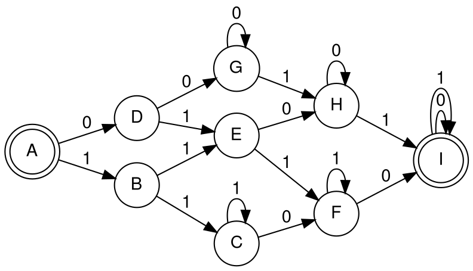

[](https://github.com/zpeng2022/edu-cpo-lab3-zpeng/actions/workflows/check.yml)

# slay_the_dragon - lab #3 - variant 4

This is an example project which demonstrates Moore finite state structure and necessary

## Project structure

- `MFSM.py` -- implementation of `Moore finite state` class
- `test_MFSM.py` -- tests for Moore finite state machine
- `localcheck.bash` -- check codestyle and typical python error
- on a local machine

## Features

- add test_FSM
- add test_FSM_from_table
- add test_elevator_example
- add test_visual
- add test_decorator

## Contribution

- Zhan,Peng (zpeng@hdu.edu.cn) -- write the main class part.
- Zhong,ZhuZhou(212320020@hdu.edu.cn) -- write the test part.

## Changelog

- 20.06.2022 - 5
 - add types control by decorator
 - add tests for types control
 - add types control checker for functions
- 18.06.2022 - 4
  - add fsm_table.txt
- 18.06.2022 - 3
  - add moore_fsm.gv
  - add moore_fsm.gv.pdf
  - add add_graphviz.py
- 06.05.2022 - 3
  - add visualize for moore finite machine
- 06.05.2022 - 2
  - add test_MFSM.py
  - add local checker
- 06.05.2022 - 1
  - add MFSM.py
  - update README.md

## Show Graphviz

- we use the python + grahviz to get
- the final image result,
- and the result is in the moore_fsm.gv.pdf



- python code

```python
import graphviz

f = graphviz.Digraph('finite_state_machine', filename='moore_fsm.gv')
f.attr(rankdir='LR', size='8,5')

f.attr('node', shape='doublecircle')
f.node('A')
f.node('I')

f.attr('node', shape='circle')
f.edge('A', 'D', label='0')
f.edge('A', 'B', label='1')
f.edge('B', 'E', label='0')
f.edge('B', 'C', label='1')
f.edge('C', 'F', label='0')
f.edge('C', 'C', label='1')
f.edge('D', 'G', label='0')
f.edge('D', 'E', label='1')
f.edge('E', 'H', label='0')
f.edge('E', 'F', label='1')
f.edge('F', 'I', label='0')
f.edge('F', 'F', label='1')
f.edge('G', 'G', label='0')
f.edge('G', 'H', label='1')
f.edge('I', 'I', label='0')
f.edge('I', 'I', label='1')

f.view()
```

## Design notes

- Advantages of unit testing:
  - it help us write better code
  - it help us catch bugs earlier
  - it makes us more efficient at writing code
  - it make us detect regression bugs
- Disadvantage of unit testing:
  - it takes time to write cases
  - tests require a lot of time for maintenance
  - it can be challenging to test GUI code
  - unit testing can't catch all errors
- Advantages of PBT testing:
  - the PBT provides a reasonable estimate of the
  - evidential test result within the relevant forensic range
- Disadvantages of PBT testing:
  - it also be challenging to test GUI code
